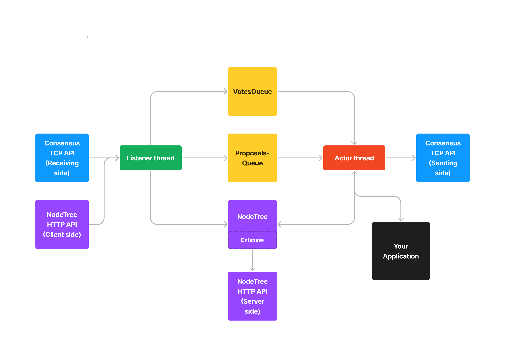

# HotStuff-rs 
HotStuff-rs is a Rust Programming Language implementation of the HotStuff consensus protocol. It offers:
1. Guaranteed Safety and Liveness in the face of up to 1/3rd of Voting Power being Byzantine at any given moment,
2. A small API (`Executor`) for plugging in state machine-based applications like blockchains, and
3. Well-documented, 'obviously correct' source code.

## 1. Reading this document
1. If you just want to *use* HotStuff-rs in your application:
2. If you want to *understand* how HotStuff-rs works:
3. If you want to *contribute* to HotStuff-rs' development:

## 2. The HotStuff Consensus Protocol

HotStuff works by building a 'NodeTree': a directed acyclic graph of Nodes. Node is a structure with a `command` field which applications are free to populate with arbitrary byte-arrays. In consensus algorithm literature, we typically talk of consensus algorithms as maintaining state machines that change their internal states in response to commands, hence, the choice of terminology.

HotStuff guarantees that committed Nodes are *immutable*. That is, they can never be *un*-committed as long as at least a supermajority of voting power faithfully execute the protocol. This guarantee enables applications to make hard-to-reverse actions with confidence. 

A Node becomes *committed* the instant its third confirmation is written into the NodeTree. A confirmation for a Node `A` is another Node `B` such that there is path between `B` to `A`.

The choice of third confirmation to define commitment--as opposed to first or second--is not arbitrary. HotStuff's safety and liveness properties actually hinge upon on this condition. If you really want to understand why this is the case, you should read the [paper](./readme_assets/HotStuff%20paper.pdf). To summarize:

1. Classic BFT consensus algorithms such as PBFT require only 2 confirmations for commitment, but this comes at the cost of expensive leader-replacement flows.
2. Tendermint require only 2 confirmations for commitment and has a simple leader-replacement flow, but needs an explicit 'wait-for-N seconds' step to guarantee liveness.

HotStuff is the first consensus algorithm with a simple leader-replacement algorithm that does not have a 'wait-for-N seconds' step, and thus can make progress as fast as network latency allows.

## 3. Overview of Major Components

### 3.1. Actor Thread

The Actor Thread drives consensus forward by participating in the creation of new Nodes.

Responsibilities:
1. Decide whether to play 'Leader' or 'Replica' in the current View.
2. Create and propose new nodes (in the '**Leader flow**') in collaboration with your Application.
3. Vote on newly proposed nodes (in the '**Replica flow**').
4. Decide how long to stay in the current View.

### 3.2. Listener Thread 

The Listener Thread ensures that the Actor Thread has all the information it needs to drive consensus forward.

Responsibilities:
1. Serve as the *exclusive* point of entry for `PROPOSE`, `VOTE`, and `NEW-VIEW` protocol messsages.
2. Identify messages that are 'from the *past*' (outdated), e.g., `PROPOSALs` that build on abandoned branches, and discard them.
3. Identify messages that are 'from the *future*', e.g., `VOTEs` on Nodes that are *not yet* in NodeTree, and get missing nodes using the NodeTree HTTP API (Client side) and insert them into the **NodeTree**.
4. Insert non-outdated `VOTEs` and `PROPOSALs` into **VotesQueue** and **ProposalsQueue** for eventual processing by the **Actor Thread**

### 3.3. NodeTree

The NodeTree maintains a constantly growing DAG of Nodes. As new Nodes are inserted into NodeTree, existing Nodes accumulate more and more confirmations. When an insertion causes an existing Node to accumulate 3 confirmations, NodeTree automatically applies its State mutations into its persistent Database and abandons conflicting branches.

### 3.4. ProposalsQueue

A mapping between View Number and the `PROPOSAL` that the Listener Thread has received for that View Number (if it has received such a proposal). When the Actor Thread takes the proposal for a particular View Number, ProposalsQueue automatically drops all proposals for smaller View Numbers.

### 3.5. VotesQueue

A mapping between View Number and the set of `VOTEs` that the Listener Thread has received for that View Number. When the Actor Thread takes the proposal for a particular View Number, VotesQueue automatically drops all votes for smaller View Numbers.

### 3.6. Consensus TCP API

The Consensus TCP API carries `PROPOSE`, `VOTE`, and `NEW-VIEW` messages between Replicas. When all Nodes are up-to-date, this is the only HotStuff-rs network API that will see any traffic. 

### 3.7. NodeTree HTTP API

The NodeTree HTTP API serves requests for Nodes in NodeTree. This is used by out-of-date Replicas to catch up to the head of the NodeTree.  

### 3.8. Your Application

Anything that *you*, the HotStuff-rs user, can imagine. The Actor thread expects it to implement a trait `Application`. In summary, Applications must implement two methods:

#### `propose(parent_node: Node, parent_state: State) -> (command: Vec<u8>, mutations: Vec<Vec<u8>, Vec<u8>>)`
Called by the Actor Thread when this participant is Leader of this view to produce a new Node that extends from `parent_node`. 

#### `approve(command: Vec<u8>, parent_node: Node, parent_state: State) -> bool`
Called by the Actor Thread when this participant is a Replica in this view. This function decides whether or not the Actor thread votes for the node containing `command`.

## 4. Protocol Description 

### 4.1. Actor Thread sequence flow

If, at any point in this sequence flow, a View timeout is triggered, jump to the **OnViewTimeout**. The Actor thread begins with a jump to **Setup**.

#### Setup 

1. Get `prepare_qc` from the NodeTree.
2. Set `cur_view_number` to the max of `prepare_qc` and `cur_view_number + 1`.
3. Compute the `leader` of View PrepareQC.view_number. 
4. If `leader` is this HotStuff-rs Replica, jump to Leader flow, else, jump to **Replica**. 

#### Leader 

1. Take a quorum of `votes` from VotesQueue.
2. Aggregate `votes` into a `qc`. 
3. Call Application to produce a new `command` extending qc.node.
4. Create a new `node` containing `command` and `qc`.
5. Insert `node` into the local NodeTree.
6. Send out a `PROPOSAL` `proposal` containing `node` to all replicas.
7. Send out a `vote` for `proposal` to the leader of the next view.
8. Jump to **Setup**.

#### Replica

1. Take a `proposal` from ProposalQueue. 
2. Call Application to execute `proposal.node.command`, if Application approves, continue, if Application disapproves, jump to **View**.
3. Insert `proposal.node` into the local NodeTree.
4. Send out a `VOTE` for `proposal` to the leader of the next view.
5. Jump to **Setup**.

#### OnViewTimeout 

1. Send out a `NEW-VIEW` containing  `prepare_qc` to the leader of the next view.
2. Jump to **Setup**.

### 4.2. View timeouts

View timeouts determine how long the Actor thread remains on a View before deciding that further progress at the current View is unlikely and moving onto the next View. 
If View timeout is a constant and Participants' View Numbers become unsynchronized at any point in the protocol's lifetime, then Participants will never become synchronized at the same View ever again, preventing further progress. 

In order to ensure that Participants eventually synchronize on the same View Number for long enough to make progress, the duration of a View timeout increases exponentially every time a timeout is triggered until some high, configurable limit. 

### 4.3. Listener Thread sequence flow 

The Listener Thread begins with a jump to **Receive**.

#### Receive

1. Receive `message` from Consensus TCP API.
2. If `message.type` is `PROPOSAL`, jump to **ProcessProposal**, else if `message.type` is `VOTE`, jump to **ProcessVote**, else if `message.type` is `NEW-VIEW`, jump to **ProcessNewView**, else, jump to **Receive**. 

#### ProcessProposal

In this section, `proposal` is an alias for `message`.

1. Check if `proposal.node.justify.node_hash` is in the NodeTree, if yes, continue, else call `CatchUpTo(node_hash). If the call succeeds, continue, else jump to **Receive**.
2. Insert `proposal` into the ProposalsQueue.

#### ProcessVote 

In this section, `vote` is an alias for `message`.

1. Check if `vote.node.justify.node_hash` is in the NodeTree, if yes, continue, else call `CatchUpTo(node_hash)`. If the call succeeds, continue, else jump to **Receive**.
2. Insert `vote` into the VotesQueue.

#### ProcessNewView

In this section, `new_view` is an alias for `message`.

#### subroutine CatchUpTo(node_hash) -> (success: bool)

### 4.4. Consensus API Types

#### **NODE(command, justify)**
|Field |Type |Description |
|---   |---  |---         |
|command |`Vec<u8>` | |
|justify |`QC` | |

##### **NodeHash**
SHA256Hash over `parent ++ command ++ justify`.

#### **QC(view_num, node_hash, sigs)**
|Field |Type |Description |
|---   |---  |---         |
|view_num |`u64` | |
|node_hash |`NodeHash` | |
|sigs |`Vec<(PublicAddress, Signature)>` | |

#### **Sig(public_address, signature)**
|Field |Type |Description |
|---   |---  |---         |
|public_address |`SHA256Hash` | |
|signature |`Ed25519Signature`

### 4.5. Consensus API Messages

#### **PROPOSE(view_number, node)**
|Field |Type |Description |
|---   |---  |---         |
|view_number |`u64` | |
|node |`Node` | |

#### **VOTE(view_num, node_hash, sig)**
|Field |Type |Description |
|---   |---  |---         |
|view_num |`u64` | |
|node_hash |`NodeHash` | |
|sig |`Sig` | |

#### **NEW-VIEW(view_num, high_qc)**
|Field |Type |Description |
|---   |---  |---         |
|view_num|`u64` | |
|high_qc |`QC` | |

