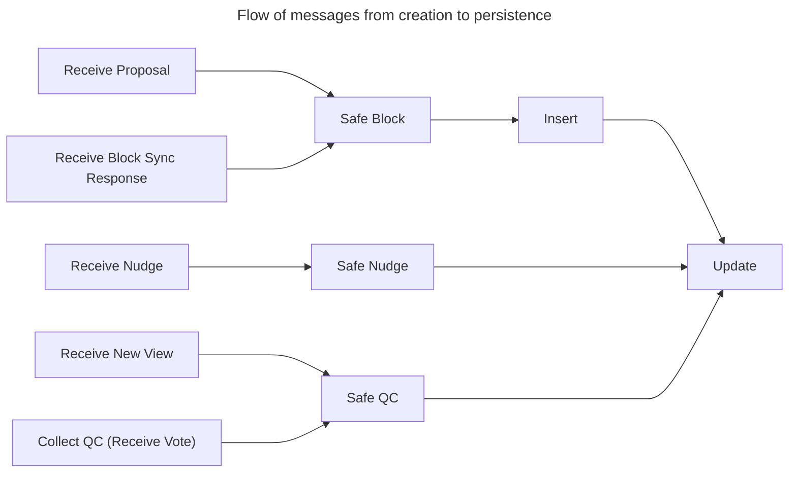

# HotStuff-rs specification

TODO: just pull this out of the Executive Summary.

## Block Tree

TODO: talk about tree of blocks, chain of blocks, etc., either in `hotstuff::state` or in `hotstuff::state::block_tree`. Should be medium-length but pretty high-level.

### Extra Fields

TODO: this is besides the core data structure described above. I think have to write this here. Should be very short.

|Field|Description|
|---|---|
|Locked QC|The currently locked QC. [Read more](#locking)|
|Highest QC|Among the quorum certificates this validator has seen and verified, the one with the highest view number.|
|Validator Sets State|TODO|

### Updaters

> Source: `hotstuff_rs::state::block_tree::BlockTree#impl-BlockTree<K>-1`

These are the methods that mutate the block tree that are called directly by code in the
subprotocols (i.e., [`hotstuff`](crate::hotstuff), [`block_sync`](crate::block_sync), and
[`pacemaker`](crate::pacemaker)). Mutating methods outside of this `impl` and the lifecycle methods
`impl` above are only used internally in this module.



#### Insert

> Source: `hotstuff_rs::state::block_tree::BlockTree::insert`

Insert into the block tree a `block` that will cause the provided `app_state_updates` and
`validator_set_updates` to be applied when it is committed in the future.

##### Relationship with `update`

`insert` does not internally call [`update`](Self::update). Calling code is responsible for
calling `update` on `block.justify` after calling `insert`.

##### Precondition

[`safe_block`](invariants::safe_block) is `true` for `block`.

#### Update

> Source: `hotstuff_rs::state::block_tree::BlockTree::update`

Update the block tree upon seeing a safe `justify` in a [`Nudge`](crate::hotstuff::messages::Nudge)
or a [`Block`].

##### Updates

Depending on the specific Quorum Certificate received and the state of the Block Tree, the updates
that this function performs will include:
1. Updating the Highest QC if `justify.view > highest_qc.view`.
2. Updating the Locked QC if appropriate, as determined by the [`qc_to_lock`](invariants::qc_to_lock)
helper.
3. Committing a block and all of its ancestors if appropriate, as determined by the
[`block_to_commit`](invariants::block_to_commit) helper.
4. Marking the latest validator set updates as decided if `justify` is a Decide QC.

##### Preconditions

The `Block` or `Nudge` containing `justify` must satisfy [`safe_block`](invariants::safe_block) or
[`safe_nudge`](invariants::safe_nudge), respectively.

#### Set Highest View Entered

> Source: `hotstuff_rs::state::block_tree::BlockTree::set_highest_view_entered`

Set the highest view entered to be `view`.

##### Preconditions

`view >= self.highest_view_entered()`.

#### Set Highest View Voted

> Source: `hotstuff_rs::state::block_tree::BlockTree::set_highest_view_voted`

Set the highest view voted to be `view`.

##### Preconditions

`view >= self.highest_view_voted()`.

#### Set Highest TC

> Source: `hotstuff_rs::state::block_tree::BlockTree::set_highest_tc`

Set the highest `TimeoutCertificate` to be `tc`.

##### Preconditions

TODO

Documentation (TODO): need to study the preconditions of this function. Good opportunity to start understanding the pacemaker.

### Invariants 

> Source: `hotstuff_rs::state::invariants`
 
Rules and predicates that help with maintaining the invariant properties of the Block Tree data
structure.

The rustdoc for this module is divided into three sections:
1. [Invariants](#invariants) clarifies the notion of block tree invariants and groups them into two
   categories depending on whether they are "local" or "global" in nature.
2. [Methods](#methods) lists the methods defined in this module and groups them into two categories
   depending on whether they deal with "whether" questions about state updates or "what" questions.
3. Finally, [Blockchain Consistency](#blockchain-consistency) discusses HotStuff-rs' overarching
   global invariant, "blockchain consistency", and how the methods in this module work together to
   enforce it.

#### Invariants
 
In the context of this module, invariants are logical properties that are always true about the
Block Tree.

Block tree invariants can be grouped into two categories depending on their scope:
- **Local Invariants**: invariants that pertain to isolated parts of the block tree. An example of a
  local invariant is the invariant enforced by `safe_nudge` that `nudge.justify.phase` must be either
  `Prepare`, `Precommit`, or `Commit`.
- **Global Invariants**: invariants that relate different parts of the block tree. An example of a
  global invariant is the invariant enforced by `safe_qc` that either: (i). `qc.block` extends from
  `block_tree.locked_qc()?.block`, or (ii). `qc.view` is greater than `block_tree.locked_qc()?.view`.

Some simple local invariants can be enforced by the type system at compile-time and therefore
do not need to be checked at runtime. For example, the typedef of `Phase` automatically guarantees
the invariant `nudge.justify.phase` could only be one of five values--`Generic`, `Prepare`, `Precommit`,
`Commit` and `Decide`.

More complicated invariants, however (including both global invariants and also more complicated local
invariants, as illustrated by the `safe_nudge` and `safe_qc` examples above), can only be enforced by
runtime logic. This is where the methods in this module come in.
 
#### Methods

The methods in this module each help enforce a combination of local and global block tree
invariants. Specifically, they do this by ensuring that every block tree *update*, i.e., set of
state mutations done by the [top-level updater methods](BlockTree#impl-BlockTree<K>-1) defined on
the `BlockTree` struct, is invariant-preserving. This idea can be summarized in simple formulaic
terms as: a block tree that satisfies invariants + a invariant-preserving update = an updated block
tree that also satisfies invariants.

Each method works to ensure that every update is invariant-preserving in one of two different ways:
1. By checking **whether** an event (like receiving a `Proposal` or collecting a `QuorumCertificate`)
   can trigger an invariant-preserving update, or
2. By determining **what** invariant-preserving updates should be made in response to an event.

These two different ways allow us to group the methods in this module into the two different
categories discussed in the following subsections.

Before reading the following subsections, please first note that not every top-level updater method
directly uses or is related to the methods in this module. In particular, `set_highest_tc`,
`set_highest_view_entered`, and `set_highest_view_voted` have simple enough preconditions that they
do not need to have functions of the "whether" category in this module, and do state updates that are
simple enough that they do not need functions of the "what" class either. The methods in this module
only directly relate to the [`insert`](BlockTree::insert) and [`update`](BlockTree::update) top-level
state mutators.

##### Category 1: "whether"

Methods in this category: [`safe_qc`], [`safe_block`], [`safe_nudge`], (outlier) [`repropose_block`].

These methods check **whether** a `QuorumCertificate`, `Block`, or `Nudge` (respectively) can
trigger invariant-preserving state updates. Methods in this category feature in the *preconditions*
of the `insert` and `update`.

We also include in this category the method called `repropose_block`. This method does not fit
neatly into this category in terms of name or purpose, but is closely related to `safe_nudge` in
that it serves to help proposers choose a block to propose that satisfy the "consecutive views"
requirement that `safe_nudge` checks.

##### Category 2: "what"

Methods in this category: [`qc_to_lock`], [`block_to_commit`].

These methods help determine **what** invariant-preserving state updates should be triggered in
`update` in response to obtaining a `QuorumCertificate`, whether through receiving a `Proposal`,
`Nudge`, or `NewView` message, or by collecting enough `Vote`s. Methods in this category are called
*inside* [`update`](BlockTree::update).

#### Blockchain Consistency

The most important global invariant that HotStuff-rs guarantees is called "Blockchain Consistency".
Blockchain consistency is the property that the block trees of all honest replicas are **identical**
below a certain block height.

This "certain block height" is exactly the height of the
[Highest Committed Block](super::block_tree#safety). Below this height, the block*tree* (a directed
acyclic graph of blocks) is reduced to a block*chain*, a directed acyclic graph of blocks with the
restriction that every block has exactly one inward edge (formed by the `justify` of its child) and
one outward edge (formed by its `justify` to its parent).

The blockchain grows as more and more blocks are *committed*. Committing is a state update whereby
a block (and transitively, all of its ancestors) become part of the permanent blockchain.
Critically, committing is a one-way update: once a block becomes committed, it can never be
un-committed. Because of this, it is essential that the protocol is designed such that a replica only
commits when it is sure that all other honest replicas have either also committed the block, or will
eventually.

This section explains how the methods in this module work together to maintain blockchain
consistency. The discussion is split into two parts:
1. First, [Locking](#locking) discusses an intermediate state that blocks enter after being inserted
but before being committed, that is, being "Locked".
2. Then, [Committing](#committing) discusses how blocks move between being locked into being committed.

#### Locking

Before a block is committed, its branch must first be locked.

Locking ensures that an honest replica only commits a block when either of the following two
conditions hold:
1. All other honest replicas have also committed the block, in which case the commit is trivially
   consistent, or
2. If not all honest replicas have committed the block, then a quorum of replicas is currently
   *locked* on the block, which makes it impossible for a QC for a conflicting block to be formed.

The consequence of condition 2 is that condition 1 will *eventually* hold, making the block safe to
commit.

Locking entails keeping track of a block tree variable called
["Locked QC"](super::block_tree#safety) and doing two things with it:
1. **Updating** the Locked QC whenever it is appropriate, according to the logic implemented by
   `qc_to_lock`, and
2. **Checking** every QC received or collected against the Locked QC. Only QCs that pass this check
   and therefore "satisfy the lock" are allowed to cause state updates.

Updating the locked QC and checking the locked QC is discussed in turn in the following two
subsections:

##### Locking on a Block

Any time `update` is called, the `locked_qc` should potentially be updated. The [`qc_to_lock`]
method in this module decides what locked QC should be *updated to*.

The precise logic used by `qc_to_lock` to decide which QC to lock on is documented in
[the doc for `qc_to_lock`](qc_to_lock#qc_to_lock-logic). In short, the basic logic for choosing
which QC to lock in HotStuff-rs is the same as the basic logic for choosing which QC to lock in the
PODC'19 HotStuff paper, that is, "lock on seeing a 2-Chain".

The basic logic is already well-documented in the PODC '19 paper, so for brevity, we do not
re-describe it here. Instead, in the rest of this subsection, we describe a small but nuanced
difference in the precise logic, and then explain the rationale behind this difference:

In both HotStuff-rs and PODC '19 HotStuff, which QC `qc_to_lock` decides to lock on upon receiving
`justify` depends on what `justify.phase` is:
- If `justify.phase` is `Generic`, `Prepare`, or `Precommit`, `qc_to_lock`'s
  decision rule is exactly the same as the decision rule used in the algorithm in the original (PODC'
  19) HotStuff paper that corresponds to the [operating mode](crate::hotstuff#operating-mode) that the
  `Phase` is part of (recall that the Pipelined Mode corresponds to Algorithm 1, while the Phased Mode
  corresponds to Algorithm 3).
- On the other hand, if `justify.phase` is `Commit` or `Decide`, `qc_to_lock` will decide to lock on
  `justify` (as long as the current `locked_qc.block` is different from `justify.block`). This is
  **different** from the logic used in Algorithm 1 in the original HotStuff paper, which does not
  update `locked_qc` upon receiving a `Commit` QC (there is no phase called `Decide` in the original
  HotStuff paper).

The reason why the PODC '19 HotStuff does not lock upon receiving a `Commit` or `Decide` QC while
HotStuff-rs does becomes clearer when we consider that the original HotStuff makes the simplifying
assumption that receiving any proposal implies that we have received every proposal in the chain
that precedes the proposal. E.g., receiving a proposal for a block at height 10 means that we (the
replica) has previously received a complete set of proposals for the ancestor blocks at heights
0..9, *including for every phase*.

This assumption simplifies the specification of the algorithm, and is one that is made by many
publications. However, this assumption is difficult to uphold in a production setting, where
messages are often dropped. HotStuff-rs' [Block Sync](crate::block_sync) goes some way toward making
this assumption hold, but is not perfect: in particular, Sync Servers only send their singular
current [`highest_qc`](crate::block_sync::messages::BlockSyncResponse::highest_qc) in their
`SyncResponse`s, which could be a QC of any phase: `Generic` up to `Decide`.

This means that if we use the same logic as used in Algorithm 1 to decide on which QC to lock on
upon receiving a [phased mode](crate::hotstuff#phased-mode) QC, i.e., to lock only if
`justify.phase == Precommit`, then we will fail to lock on `justify.block` if `justify.phase` is
`Commit` or `Decide`, which can lead to safety violations because the next block may then extend
a conflicting branch.

Because extending the Block Sync protocol to return multiple QCs in a `SyncResponse` could be
complicated (in particular, it would probably require replicas to store extra state), we instead
solve this issue by deviating from PODC '19 HotStuff slightly by locking upon receiving a
`Commit` or `Decide` QC.

##### Checking against the Lock

The [3rd predicate of `safe_qc`](safe_qc#conditional-checks) checks whether any received or
collected QC satisfies the lock and therefore is allowed to trigger state updates. This predicate
is exactly the same as the corresponding predicate in the PODC '19 HotStuff paper, but is simple
enough that we describe it and the rationale behind it fully in the rest of this subsection.

The 3rd predicate comprises of two clauses, joined by an "or":
1. **Safety clause**: `qc.block` extends from `locked_qc.block`, *or*
2. **Liveness clause**: `qc.view` is greater than `locked_qc.view`.

In stable cases--i.e., where in every view, either 1/3rd of replicas lock on the same `locked_qc`,
or none lock--the safety clause will always be satisfied. This ensures that the `qc` extends the
branch headed by the locked block.

In unstable cases, however, where e.g., messages are dropped or a proposer is faulty, less than
1/3rd but more than zero replicas may lock on the same `locked_qc`. If, in this scenario, `safe_qc`
only comprises of the safety clause and a `Block` or `Nudge` that conflicts with `locked_qc` is
proposed in the next view, only replicas that didn't lock on `locked_qc` in the previous view will
be able to accept the new `Block` or `Nudge` and make progress, while the replicas that did lock
will be stuck, unable to grow their blockchain further.

This is where the liveness clause comes in. This clause enables the replicas that did lock on the
now "abandoned" QC to eventually accept new `Block`s and `Nudge`s, and does so by relaxing the
third predicate to allow `Block`s and `Nudge`s that build on a different branch than the current
`locked_qc.block` to cause state updates as long as the QC they contain has a higher view than
`locked_qc.view`.

#### Committing

As is the case with Locking, Committing in HotStuff-rs follows the same basic logic as committing in
PODC '19 HotStuff, but with a small and nuanced difference. The following two subsections discuss, in
turn:
1. Under what conditions will a block become committed, one of the conditions being a "consecutive
   views requirement" that is more relaxed than the "same views requirement" used in Algorithm 1 of
   PODC '19 HotStuff.
2. How the algorithm requires that replicas *re-propose* existing blocks in certain conditions in order
   to satisfy the consecutive views requirement while still achieving Immediacy.

##### Committing a Block

Any time `update` is called, blocks should potentially be committed. The [`block_to_commit`] method
in this module decides what blocks should be committed.

Like with `qc_to_lock`, the precise logic used by `block_to_commit` is documented in
[the doc for `block_to_commit`](block_to_commit#block_to_commit-logic). Again, the logic used for
choosing which block to commit in HotStuff-rs is broadly similar as the logic used for choosing
which block to commit in the PODC '19 HotStuff paper.

In particular, the logic used in HotStuff-rs' Pipelined Mode is the same as the logic used in
Algorithm 3 in PODC '19 HotStuff; that is, a block should be committed in the Pipelined Mode when it
meets two requirements:
1. **3-Chain**: the block must head a sequence of 3 QCs.
2. **Consecutive views**: the 3 QCs that follow the block must each have *consecutively increasing*
   views, i.e., `justify3.view == justify2.view + 1 == justify1.view + 2` where
   `justify3.block.justify == justify2`, `justify2.block.justify == justify1`, and `justify1.block
   = block`.

The nuanced difference between HotStuff-rs and PODC '19 HotStuff with regards to `block_to_commit`
logic has to do with the *Phased Mode*. Specifically, the difference is that PODC '19's Algorithm 1
requires that `Prepare`, `Precommit`, and `Commit` QCs that follow a block have the **same view**
number in order for this sequence of QCs to commit the block, whereas on the other hand,
HotStuff-rs' Phased Mode requires *only* that these QCs have **consecutive view** numbers, just
like Pipelined Mode and Algorithm 3.

The underlying reason why the same view requirement is used in PODC '19's Algorithm 1 but the
strictly less stringent consecutive views requirement is used in Phased Mode is one specific
difference between these two algorithms:
- In Algorithm 1, each view is comprised of *3 phases*.
- In Phased Mode, each view is comprised of only *1 phase*.

The result is that in Phased Mode, `Prepare`, `Precommit`, and `Commit` QCs can *never* have the
same view number, so if "same view" is a requirement to commit a block in Phased Mode, no block can
ever be committed.

The consecutive views requirement relaxes `block_to_commit` enough in order for blocks to be
committed, but does not relax it *too* far that it would obviate the uniqueness guarantee provided
by locking.

Consider what could happen if we had instead, for example, relaxed the requirement further to just
"increasing views", and a replica commits a block upon receiving `Prepare`, `Precommit`, and
`Commit` QCs for the block with views 4, 5 and 7. Because 5 and 7 are not contiguous, it could be
the case that in view 6, a quorum of replicas have locked on a conflicting block, so it would be
incorrect to assume that a quorum of replicas is currently locked on the block, and therefore it is
unsafe in this situation to commit the block.

##### Ensuring Immediacy

Recall that Immediacy requires validator set updating blocks to be committed by a `Commit` QC
before a direct child can be inserted. This requirement, combined with the consecutive views
requirement, creates a challenge for proposers.

Normally, proposers query the `highest_qc` and broadcast a `Proposal` or `Nudge` containing it
to all replicas. When views fail to make progress, however, the `current_view` of live replicas may
grow to significantly greater than `highest_qc.view`. If in this situation, more than 1/3rd of
replicas have locked on a validator set updating block, proposers must not propose a `Nudge`
containing the highest QC, since the [4th predicate of `safe_nudge`](safe_nudge#conditional-checks)
wil prevent honest replicas from voting on it, and hence prevent a quorum for the `Nudge` from being
formed.

To make progress in this situation, a proposer must re-propose either the locked block, or a
(possibly new) sibling of the locked block. The implementation in HotStuff-rs chooses to do the
former: the [`repropose_block`] method in this module helps determine whether a proposer should
re-propose a block by considering its `current_view` and the local block tree's `highest_view.qc`,
and if it finds that it *should* re-propose a block, returns the hash of the block that should
be re-proposed so that the proposer can get it from the block tree.

#### Safe Block

> Source: `hotstuff_rs::state::invariants::safe_block`

Check whether `block` can safely cause updates to `block_tree`, given the replica's `chain_id`.

##### Conditional checks

`safe_block` returns `true` in case all of the following predicates are `true`:
1. `safe_qc(&block.justify, block_tree, chain_id)`.
2. `block.qc.phase` is either `Generic` or `Decide`.

##### Precondition

[`is_correct`](Block::is_correct) is `true` for `block`.

#### Safe QC

> Source: `hotstuff_rs::state::invariants::safe_qc`

Check whether `block` can safely cause updates to `block_tree`, given the replica's `chain_id`.

##### Conditional checks

`safe_block` returns `true` in case all of the following predicates are `true`:
1. `safe_qc(&block.justify, block_tree, chain_id)`.
2. `block.qc.phase` is either `Generic` or `Decide`.

##### Precondition

[`is_correct`](Block::is_correct) is `true` for `block`.

#### Safe Nudge

> Source: `hotstuff_rs::state::invariants::safe_nudge`

Check whether `nudge` can safely cause updates to `block_tree`, given the replica's `current_view`
and `chain_id`.

##### Conditional checks

`safe_nudge` returns `true` in case all of the following predicates are `true`:
1. `safe_qc(&nudge.justify, block_tree, chain_id)`.
2. `nudge.justify.phase` is `Prepare`, `Precommit`, or `Commit`.
3. `nudge.chain_id` equals `chain_id`.
4. `nudge.justify.phase` is either `Commit`, or `nudge.justify.view = current_view - 1`.

##### Precondition

[`is_correct`](crate::types::collectors::Certificate::is_correct) is `true` for `nudge.justify`.

#### Repropose Block

> Source: `hotstuff_rs::state::invariants::repropose_block`

Get the `Block` in the `block_tree` which a leader of the `current_view` should re-propose in order
to satisfy the Consecutive Views Rule and make progress in the view.

##### Usage

If `Ok(Some(block_hash))` is returned, then the leader should re-propose the block identified by
`block_hash`.

Else if `Ok(None)` is returned, then the leader should either propose a new block, or
nudge using the highest qc.

##### Rationale

The Consecutive Views Rule and the purpose of `repropose_block` is explained in the
["Committing"](super::invariants#committing) section of `safety`'s module-level docs.

#### QC to Lock 

> Source: `hotstuff_rs::state::invariants::qc_to_lock`

Get the QC (if any) that should be set as the Locked QC after the replica sees the given `justify`.

##### Precondition

The block or nudge containing this justify must satisfy [`safe_block`] or [`safe_nudge`]
respectively.

##### `qc_to_lock` logic

`qc_to_lock`'s return value depends on `justify`'s phase and whether or not it is the Genesis QC.
What `qc_to_lock` returns in every case is summarized in the below table:

|`justify` is the/a|QC to lock if not already the current locked QC|
|---|---|
|Genesis QC|`None`|
|`Generic` QC|`justify.block.justify`|
|`Prepare` QC|`None`|
|`Precommit` QC|`justify`|
|`Commit` QC|`justify`|
|`Decide` QC|`justify`|

##### Rationale

The rationale behind `qc_to_lock`'s logic is explained in the ["Locking"](super::invariants#locking)
module-level docs.

#### Block to Commit

> Source: `hotstuff_rs::state::invariants::block_to_commit`

Get the `Block` in `block_tree` (if any) that, along with all of its uncommitted predecessors,
should be committed after the replica sees `justify`.

##### Preconditions

The `Block` or `Nudge` containing `justify` must satisfy [`safe_block`] or [`safe_nudge`]
respectively.

##### `block_to_commit` logic

`block_to_commit`'s return value depends on `justify`'s phase and whether or not it is the Genesis
QC. What `block_to_commit` returns in every case is summarized in the below table:

|`justify.phase` is a|Block to commit if it satisfies the consecutive views rule *and* is not already committed yet|
|---|---|
|`Generic` QC|`justify.block.justify.block.justify.block`|
|`Prepare` QC|`None`|
|`Precommit` QC|`None`|
|`Commit` QC|`justify.block`|
|`Decide` QC|`justify.block`|

##### Rationale

The rationale behind `block_to_commit`'s logic is explained in the
["Committing"](super::invariants#committing) section of `safety`'s module-level docs.

## HotStuff

### Types

#### Quorum Certificate

TODO Wednesday.

### Volatile State

TODO: talk about volatile state this one in memory no need to be persistent.

#### Vote Collector

TODO (documentation): Tuesday.7.

#### Keypair

TODO:
- Identify the replica.
- Encrypt communications.
- Sign Votes.

#### App

##### Timing

#### Current View

### Messages

#### Proposal

> Source: `hotstuff_rs::hotstuff::messages::Proposal`

Message broadcasted by a leader in `view`, who proposes it to extend the block tree identified by
`chain_id` by inserting `block`.

#### Nudge

> Source: `hotstuff_rs::hotstuff::messages::Nudge`

Message broadcasted by a leader in `view` to "nudge" other validators to participate in the voting
phase after `justify.phase` in order to make progress in committing a **validator-set-updating**
block in the block tree identified by `chain_id`.

#### Vote

> Source: `hotstuff_rs::hotstuff::messages::Vote`

Message sent by a validator to [a leader of `view + 1`](super::voting::vote_recipient) to vote for
a [`Proposal`] or [`Nudge`].

#### New View

> Source: `hotstuff_rs::hotstuff::messages::NewView`

Message sent by a replica to the next leader on view timeout to update the next leader about the
highest QC that replicas know of.

##### `NewView` and view synchronization

In the original HotStuff protocol, the leader of the next view keeps track of the number of
`NewView` messages collected in the current view with the aim of advancing to the next view once a
quorum of `NewView` messages are seen. This behavior can be thought of as implementing a rudimentary
view synchronization mechanism, which is helpful in the original HotStuff protocol because it did
not come with a "fully-featured" BFT view synchronization mechanism.

HotStuff-rs, on the other hand, *does* include a separate BFT view synchronization mechanism (in the
form of the [Pacemaker](crate::pacemaker) module). Therefore, we deem replicating this behavior
unnecessary.

### Actions

#### Enter View

> Source: `hotstuff_rs::hotstuff::protocol::HotStuff::enter_view`

On receiving a new [`ViewInfo`] from the [`Pacemaker`](crate::pacemaker::protocol::Pacemaker), send
messages and perform state updates associated with exiting the current view, and update the local
view info.

##### Internal procedure

This function executes the following steps:
1. Send a [`NewView`] message for the current view to the leader of the next view.
2. Update the internal view info, proposal status, and vote collectors to reflect `new_view_info`.
3. Set `highest_view_entered` in the block tree to the new view, then emit a `StartView` event.
4. If serving as a leader of the newly entered view, broadcast a `Proposal` or a `Nudge`.

##### Precondition

[`is_view_outdated`](Self::is_view_outdated) returns true. This is the case when the Pacemaker has updated
`ViewInfo` but the update has not been made available to the [`HotStuff`] struct yet.

##### Simplified code

```rust
fn enter_view(view: ViewNum) {
    // 1. Create a NewView message for the current view and send it to the next leader(s).
    let new_view = NewView {
        chain_id,
        view: current_view,
        highest_qc: block_tree.highest_qc(),
    }

    for leader in new_view_recipients(&new_view, block_tree.validator_sets_state()) {
        network.send(leader, new_view);
    }

    // 2. Update the HotStuff subprotocol's copy of the current view.
    current_view = view;

    // 3. Replace the existing vote collectors with new ones for the current view.
    vote_collectors = VoteCollector::new(chain_id, current_view, block_tree.validator_sets_state());

    // 4. If I am a proposer for the newly-entered view, then broadcast a `Proposal` or a `Nudge`.
    if is_proposer(
        keypair.verifying(),
        view,
        block_tree.validator_sets_state(),
    ) {
        // 4.1. If a chain of consecutive views justifying a validator set updating block has been broken,
        // re-propose the validator set updating block.
        if let Some(block) = block_tree.repropose_block(view) {
            let proposal = Proposal {
                chain_id,
                view,
                block,
            }

            network.broadcast(proposal);
        }

        // 4.2. Otherwise, decide whether to broadcast a new proposal, or a new nudge, according to phase of the highest QC.
        else {
            match block_tree.highest_qc().phase {

                // 4.2.1. If the phase of the highest QC is Generic or Decide, create a new Proposal and broadcast it.
                Phase::Generic | Phase::Decide => {
                    let block = app.produce_block(&block_tree, block_tree.highest_qc());
                    let proposal = Proposal {
                        chain_id,
                        view,
                        block,
                    }

                    network.broadcast(proposal);
                },

                // 4.2.2. If the phase of the highest QC is Prepare, Precommit, or Commit, create a new Nudge and broadcast it.
                Phase::Prepare | Phase::Precommit | Phase::Commit => {
                    let nudge = Nudge {
                        chain_id,
                        view,
                        justify: block_tree.highest_qc(),
                    }

                    network.broadcast(nudge);
                }
            }
        }
    }
}
```

#### On Receive Proposal

> Source: `hotstuff_rs::hotstuff::protocol::HotStuff::on_receive_proposal`

Process a newly received `proposal`.

##### Preconditions

[`is_proposer(origin, self.view_info.view, &block_tree.validator_set_state()?)`](is_proposer).


##### Simplified code

```rust
fn on_receive_proposal(proposal: Proposal, origin: VerifyingKey) {
    // 1. Confirm that `origin` really is a proposer in the current view. 
    if is_proposer(origin, current_view, block_tree.validator_set_state()) {

        // 2. Confirm that `proposal.block` is safe according to the rules of the block tree.
        if block_tree.safe_block(&proposal.block, chain_id) {

            // 3. Confirm that `proposal.block` is valid according to the rules of the app.
            if let Ok((app_state_updates, validator_set_updates)) = app.validate_block(&block_tree) {

                // 4. Insert `proposal.block` into the block tree.
                block_tree.insert(proposal.block, app_state_updates, validator_set_updates);

                // 5. Update the block tree using `proposal.block.justify`.
                block_tree.update(&proposal.block.justify);

                // 6. Tell the vote collectors to start collecting votes according to the new validator sets state (which
                // may or may not have been changed in the block tree update in the previous step).
                vote_collectors.update_validator_sets(block_tree.validator_sets_state());

                // 7. If the local replica's votes can become part of QCs that directly extend `proposal.block.justify`,
                //    vote for `proposal`.
                if is_voter(
                    keypair.public(),
                    block_tree.validator_sets_state(),
                    &proposal.block.justify,
                ) {
                    // 7.1. Compute the phase to vote in: if `proposal.block` updates the validator set, then vote in the
                    //      `Prepare` phase. Otherwise, vote in the `Generic` phase.
                    let vote_phase = if validator_set_updates.is_some() {
                        Phase::Prepare
                    } else {
                        Phase::Generic
                    }
                    let vote = Vote::new(
                        keypair,
                        chain_id,
                        current_view,
                        proposal.block.hash,
                        vote_phase,
                    );

                    // 7.2. Send the vote to the leader that should receive it.
                    network.send(vote, vote_recipient(&vote, block_tree.validator_sets_state()));
                }
            }
        }
    }
}
```

#### On Receive Nudge

Process the received nudge.

##### Preconditions

[`is_proposer(origin, self.view_info.view, &block_tree.validator_set_state()?)`](is_proposer).

##### Simplified code


```rust
fn on_receive_nudge(nudge: Nudge, origin: VerifyingKey) {
    // 1. Confirm that `origin` really is a proposer in the current view. 
    if is_proposer(origin, current_view, block_tree.validator_set_state()) {

        // 2. Confirm that `nudge` is safe according to the rules of the block tree.
        if block_tree.safe_nudge(&nudge, current_view, chain_id) {

            // 3. Update the block tree using `nudge.justify`.
            block_tree.update(&nudge.justify);

            // 4. Tell the vote collectors to start collecting votes according to the new validator sets state (which
            // may or may not have been changed in the block tree update in the previous step).
            vote_collectors.update_validator_sets(block_tree.validator_sets_state());

            // 5. If the local replica's votes can become part of QCs that directly extend `nudge.justify`, vote for
            //    `nudge`.
            if is_voter(
                keypair.public(),
                block_tree.validator_sets_state(),
                &nudge.justify,
            ) {
                // 5.1. Compute the phase to vote in: this will be the phase that follows `nudge.justify.phase`.
                let vote_phase = match nudge.justify.phase {
                    Phase::Prepare => Phase::Precommit,
                    Phase::Precommit => Phase::Commit,
                    Phase::Commit => Phase::Decide,
                    _ => unreachable!("`safe_nudge` should have ensured that `nudge.justify.phase` is neither `Generic` or `Decide`"),
                };
                let vote = Vote::new(
                    keypair,
                    chain_id,
                    current_view,
                    proposal
                )

                // 5.2. Send the vote to the leader that should receive it.
                network.send(vote, vote_recipient(&vote, block_tree.validator_sets_state()))
            }
        }
    }
}
```

#### On Receive Vote

Process the received vote. 

##### Simplified code

```rust
fn on_receive_vote(vote: Vote, origin: VerifyingKey) {
    // 1. Confirm that `vote` was signed by `origin`.
    if vote.is_correct(origin) {

        // 2. Collect `vote` using the vote collectors.
        let new_qc = vote_collectors.collect(vote, origin);

        // 3. If sufficient votes were collected to form a `new_qc`, use `new_qc` to update the block tree. 
        if let Some(new_qc) = new_qc {
            // 3.1. Confirm that `new_qc` is safe according to the rules of the block tree. 
            // 
            // Note (TODO): I can think of at least three ways this check can fail:
            // 1. A quorum of replicas are byzantine and form a QC with an illegal phase, that is:
            //     1. A Generic QC that justifies a VSU-block.
            //     2. A non-Generic QC that justifies a non-VSU-block.
            // 2. We forgot to create a new vote collector with a higher view in `enter_view` (library bug). 
            // 3. We collected a QC for a block that isn't in the block tree yet (block sync may help).
            if block_tree.safe_qc(new_qc) {

                // 3.2. Update the block tree using `new_qc`.
                block_tree.update(new_qc);

                // 3.3. Tell the vote collectors to start collecting votes according to the new validator sets state (which
                // may or may not have been changed in the block tree update in the previous step). 
                vote_collectors.update_validator_sets(block_tree.validator_set_state());
            }
        }
    }
}
```

#### On Receive New View

```rust
fn on_receive_new_view(new_view: NewView, origin: VerifyingKey) {
    // 1. Confirm that `new_qc` is safe according to the rules of the block tree. 
    if block_tree.safe_qc(&new_view.highest_qc) {

        // 2. Update the block tree using `new_view.highest_qc`.
        block_tree.update(new_view.highest_qc);

        // 3. Tell the vote collectors to start collecting votes according to the new validator sets state (which
        // may or may not have been changed in the block tree update in the previous step). 
        vote_collectors.update_validator_sets(block_tree.validator_set_state());
    }
}
```

### Validator Roles

> Source: `hotstuff_rs::hotstuff::roles`

Functions that determine what roles a replica should play at any given View and Validator Set State.

#### Is Validator

Determine whether the `replica` is an "active" validator, given the current `validator_set_state`.

An active validator can:
- Propose/nudge and vote in the HotStuff protocol under certain circumstances described above,
- Contribute [timeout votes](crate::pacemaker::messages::TimeoutVote) and
   [advance view messages](crate::pacemaker::messages::AdvanceView).

##### `is_validator` logic

Whether or not `replica` is an active validator given the current `validator_set_state` depends on
two factors:
1. Whether `replica` is part of the Committed Validator Set (CVS), the Previous Validator Set (PVS),
   both validator sets, or neither.
2. Whether `validator_set_state.update_decided()` or not.

The below table specifies exactly the return value of `is_validator` in every possible combination
of the two factors:

||Validator Set Update Decided|Validator Set Update Not Decided|
|---|---|---|
|Part of CVS (and maybe also PVS)|`true`|`true`|
|Part of PVS only|`false`|`true`|
|Part of neither neither CVS or PVS|`false`|`false`|

#### Is Proposer

> Source: `hotstuff_rs::hotstuff::roles::is_proposer`

Determine whether `validator` should act as a proposer in the given `view`, given the current
`validator_set_state`.

##### `is_proposer` Logic

Whether or not `validator` is a proposer in `view` depends on two factors:
1. Whether or not  `validator` is the [leader](select_leader) in either the CVS or the PVS in
   `view` (it could possibly be in both), and
2. Whether or not `validator_set_update.update_decided`.

The below table specifies exactly the return value of `is_proposer` in every possible combination
of the two factors:

||Validator Set Update Decided|Validator Set Update Not Decided|
|---|---|---|
|Leader in CVS (and maybe also PVS)|`true`|`true`|
|Leader in PVS only|`false`|`true`|
|Leader in neither CVS or PVS|`false`|`false`|

#### Is Voter

> Source: `hotstuff_rs::hotstuff::roles::is_voter`

Determine whether or not `replica` should vote for the `Proposal` or `Nudge` that `justify` was taken
from. This depends on whether `replica`'s votes can become part of quorum certificates that directly
extend `justify`.

If this predicate evaluates to `false`, then it is fruitless to vote for the `Proposal` or `Nudge`
that `justify` was taken from, since according to the protocol, the next leader will ignore the
replica's votes anyway.

##### `is_voter` Logic

`replica`'s vote can become part of QCs that directly extend `justify` if-and-only-if `replica` is
part of the appropriate validator set in the `validator_set_state`, which is either the committed
validator set (CVS), or the previous validator set (PVS). In turn, which of CVS and PVS is the
appropriate validator set depends on two factors:
1. Whether or not `validator_set_update.update_decided()`, and
2. What `justify.phase` is:

The below table specifies which validator set `replica` must be in order to be a voter in every
possible combination of the two factors:

||Validator Set Update Decided|Validator Set Update Not Decided|
|---|---|---|
|Phase == `Generic`, `Prepare`, `Precommit`, or `Decide`|CVS|PVS|
|Phase == `Commit`|CVS|CVS|

##### Preconditions

`justify` satisfies [`safe_qc`](crate::state::safety::safe_qc) and
[`is_correct`](crate::types::collectors::Certificate::is_correct), and the block tree updates
associated with this `justify` have already been applied.

#### Vote Recipient

> Source: `hotstuff_rs::hotstuff::roles::vote_recipient`

Identify the leader that `vote` should be sent to, given the current `validator_set_state`.

##### `vote_recipient` Logic

The leader that `vote` should be sent to is the leader of `vote.view + 1` in the appropriate
validator set in the `validator_set_state`, which is either the committed validator set (CVS) or the
previous validator set (PVS). Which of the CVS and the PVS is the appropriate validator set depends
on two factors: 1. Whether or not `validator_set_update.update_decided`, and 2. What `justify.phase`
is:

||Validator Set Update Decided|Validator Set Update Not Decided|
|---|---|---|
|Phase == `Generic`, `Prepare`, `Precommit`, or `Commit`|CVS|PVS|
|Phase == `Decide`|CVS|CVS|

#### New View Recipients

> Source: `hotstuff_rs::hotstuff::roles::new_view_recipients`

Identify the leader(s) that `new_view` should be sent to, given the current `validator_set_state`.

##### `new_view_recipients` Logic

Upon exiting a view, a replica should send a `new_view` message to the leader of `new_view.view + 1`
in the committed validator set (CVS), *and*, if `!validator_set_state.update_decided` (not decided),
*also* to the leader of the same view in the previous validator set (PVS).

##### Return value

Returns a pair containing the following items:
1. `VerifyingKey`: the leader in the committed validator set in `new_view.view + 1`.
2. `Option<VerifyingKey>`: the leader in the resigning validator set in `new_view.view + 1` (`None`
    if the most recently initiated validator set update has been decided).